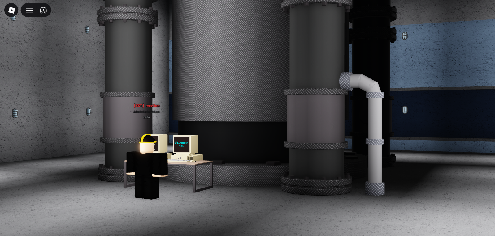
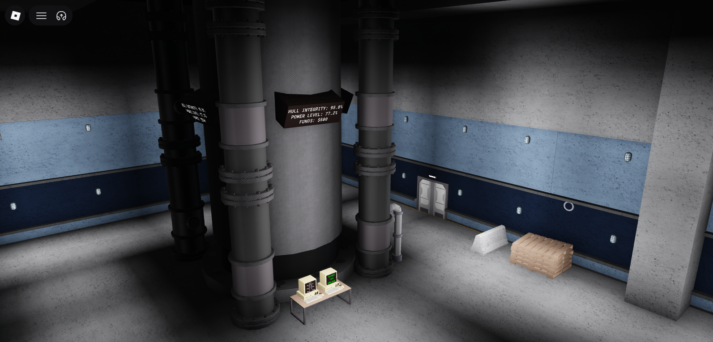
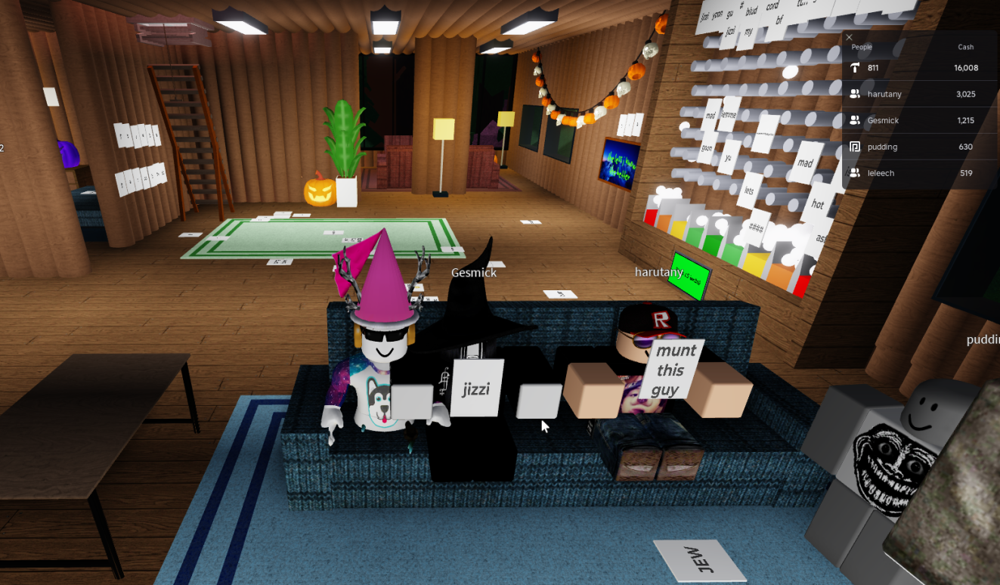
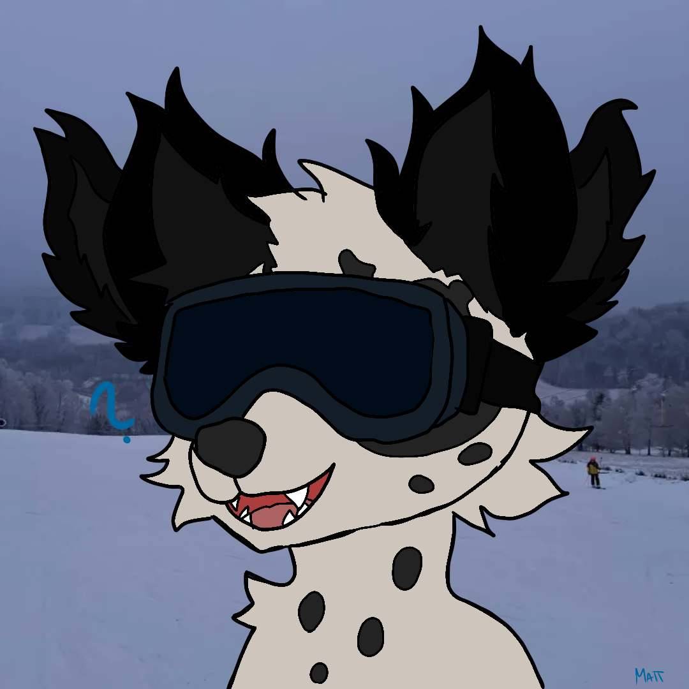
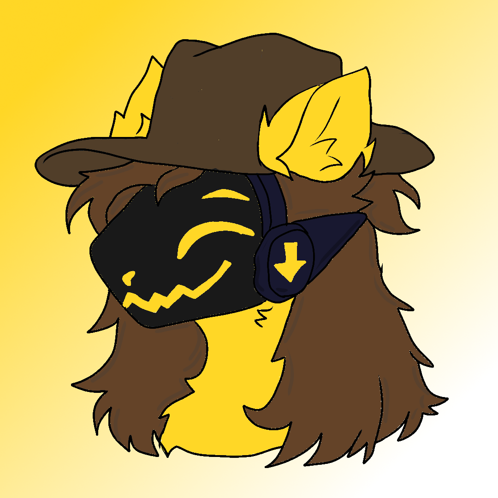

# Bio
## Introductions
Hey, I am Matthew (Matěj, wez3mn, wez, mink), I am a coder (mainly then Lua(u), python, and I know some basics of HTML+CSS), Roblox builder, UI designer (even though it isn't my strongest suit) and game designer. I had to learna  lot of things because I always worked solo so I am a low maintenance needed member of a team, I can work in teams, lead them or listen to a figure because I am a sea scout, I lead groups and I also have to listen to authority, I am also a good listener in general and I can do a lot when I lock in or get myself to it. I am focused on losing weight, gaining muscles and getting good grades lately (all three going beyond well) but I am more than capable of being active almost every other day. Back to professional stuff: I've been working for many many years and I even received the Sparkletime Crown of O's for _my_ own game, I have experience in many fields and many types of games because I like to try new things, the only type of games I don't like doing are simulator games, most other types of games I am okay with working on alone or in a team. I recommend reading everything below this. _ESPECIALLY the JEURS game_

# Actual Production
## Ro-Link
Ro-link is a feature-rich profile/portfolio/introduction page making game. The dashboard offers custom bios, pronouns, background images, profile pictures and more. More info about Ro-Link is inside of the codesnippet.lua file in "Scripts"

<table border="0" cellpadding="10" cellspacing="0" width="100%">
  <tr>
    <td width="45%" align="center" valign="middle">
      
    </td>
    <td width="55%" valign="middle" style="font-size: 16px; line-height: 1.6;">
      

        Your expression on Ro-Link is fully in your hands with my dashboard and customization features, you can add many different modules into your profile and customize them, I added many features and ways to customize your profile and it makes it very very easy to make good-looking profiles. This is my profile on the platform. The background image is one I took on the czech mountain Lysá hora.
      

    </td>
  </tr>
</table>

<table border="0" cellpadding="10" cellspacing="0" width="100%">
  <tr>
    <td width="55%" valign="middle" style="font-size: 16px; line-height: 1.6;">
      

        You can very easily create cool-looking, minimalist and cold profiles, this is the profile of a random user. The only limitation is Roblox itself, it compresses all images into low quality, it can still look cool on a profile, like in this person's profile. It also offers an actual side of the bio-LINK name, you can give people a link and when the game is launched using that link, your profile will instantly load up and show upon the game loading. 
      

      

        <strong>Check your profile editing dashboard for your Ro-link link.</strong>
      

    </td>
    <td width="45%" align="center" valign="middle">
      
    </td>
  </tr>
</table>

## Burger Game
stim game, not finished, still shows the skill on server-side (even if it can be shitty because it isn't finished) 

### Jizian Empire Underwater Research Station (JEURS)
This is an unfinished larp game I wanted to make for my group (Jizian Empire) but never ended up finshing. It is similar to naramo and some other research games.
It offers an entire team system with leveling, ranks with leveling, administration quests, machinery wing where the facility has to be maintained. 
The entire core (the hull) can be destroyed, repaired and managed. The higher the payload on the hull, the more money, electricity but the hull breaks faster and more features. I spent a lot of hours and time working on this game but I decided that it wasn't good enough to release, it is still important to talk about I feel like because of how complex the game's code got sometimes. 

### Game
<table border="0" cellpadding="10" cellspacing="0" width="100%">
  <tr>
    <td width="45%" align="center" valign="middle">
      
    </td>
    <td width="55%" valign="middle" style="font-size: 16px; line-height: 1.6;">
      

        The JEURS administration wing and facility (hull) control room. All operations are managed from here including ordering new executive orders that use the facility funds, activating hull shields (self-repair) and more. All administration staff also spawn here and the safety bunker (for hull explosions) is located here.
      

    </td>
  </tr>
</table>

<table border="0" cellpadding="10" cellspacing="0" width="100%">
  <tr>
    <td width="55%" valign="middle" style="font-size: 16px; line-height: 1.6;">
      

        The JEURS hallways. JEURS has a wide map set at the bottom of the sea split into 3 main wings, scientific, administration and engineering. All three serve their own purpose and the game needs all three to function, the game is playable in 2 or even 1 because a player can pass quickly enough to other parts and the administration team has access to every action, room and area of the facility. 
      

      

        <strong>JEURS is not playable and will not be, these screenshots should be enough.</strong>
      

    </td>
    <td width="45%" align="center" valign="middle">
      
    </td>
  </tr>
</table>

### Hull
<table border="0" cellpadding="10" cellspacing="0" width="100%">
  <tr>
    <td width="45%" align="center" valign="middle">
      
    </td>
    <td width="55%" valign="middle" style="font-size: 16px; line-height: 1.6;">
      

        The hull is an important part of the game, the entire facility depends on it for production of electricity, oil mining (thus funds), pressurization and the overall activity of the facility. The administration team operates it from the administration wing, the science department does the "reasearch" in the name and operates it from the hull access point and the engineering team operates it from the engineering wing, making sure all systems are online (including cleaning CO2 filters, the CO2 system is an important mechanic, if the filters aren't cleaned and replaced, CO2 starts to build up and choke the crew, this shows in multiple different ways). 
      

    </td>
  </tr>
</table>

<table border="0" cellpadding="10" cellspacing="0" width="100%">
  <tr>
    <td width="55%" valign="middle" style="font-size: 16px; line-height: 1.6;">
      

        The hull access point is a place in the science wing of the JEURS where the science department can monitor, closely operate the hull and report any data back to the administration, the science department has, however, nowhere close to the administration team in terms of controlling the hull. 
      

      

        <strong>The science deparment can however start a file upload and do more small tasks, these eat electricity, take a lot of time but earn funds.</strong>
      

    </td>
    <td width="45%" align="center" valign="middle">
      
    </td>
  </tr>
</table>

## Lesser projects
projects that never saw the day of light (or aren't so important etc.) but I think are worth mentioning

### Modern Log Cabin
Originally a silly meetup game for my communities (it got really crowded) turned into a somewhat testing ground for small projects and modules to add into games, MLC is a nice cozy meetup game with many cool features and things to do, including a pretty cool handmade shop style that I have only seen done in flex your weather before where the product is a physical 3D object you click to buy, a plinko, AFK mode, day/night mode, secret rooms, money earning, a click-to-sit system and a very cool note system (tool handled), this also shows my skills with player interaction and server-side too.

<table border="0" cellpadding="10" cellspacing="0" width="100%">
  <tr>
    <td width="45%" align="center" valign="middle">
      
    </td>
    <td width="55%" valign="middle" style="font-size: 16px; line-height: 1.6;">
      

        The main interior of the cabin.
      

    </td>
  </tr>
</table>

<table border="0" cellpadding="10" cellspacing="0" width="100%">
  <tr>
    <td width="55%" valign="middle" style="font-size: 16px; line-height: 1.6;">
      

        Other screenshot from the log cabin mid-meetup with my communities
      

      

        <strong>Please note some stuff might be inappropriate.</strong>
      

    </td>
    <td width="45%" align="center" valign="middle">
      
    </td>
  </tr>
</table>

<table border="0" cellpadding="10" cellspacing="0" width="100%">
  <tr>
    <td width="55%" valign="middle" style="font-size: 16px; line-height: 1.6;">
      

        Other screenshot from the log cabin mid-meetup with my communities
      

      

        <strong>Please note some stuff might be inappropriate.</strong>
      

    </td>
    <td width="45%" align="center" valign="middle">
      
    </td>
  </tr>
</table>

### Sobertiy Pools
an unsettling game with Y2K, Liquid glass and Frutiger Aero elements. It is the game I used the camera damp. script (codesnippet2.lua) in.

<table border="0" cellpadding="10" cellspacing="0" width="100%">
  <tr>
    <td width="55%" valign="middle" style="font-size: 16px; line-height: 1.6;">
      

        A real screenshot from the game 
      

      

        <strong>The map is not finished and probably won't be ever.</strong>
      

    </td>
    <td width="45%" align="center" valign="middle">
      
    </td>
  </tr>
</table>

## Art
The art section
<table border="0" cellpadding="10" cellspacing="0" width="100%">
  <tr>
    <td width="55%" valign="middle" style="font-size: 16px; line-height: 1.6;">
      

        A commission
      

      

        <strong>Don't steal, I was given permission by the commission person to put it here</strong>
      

    </td>
    <td width="45%" align="center" valign="middle">
      
    </td>
  </tr>
</table>

<table border="0" cellpadding="10" cellspacing="0" width="100%">
  <tr>
    <td width="55%" valign="middle" style="font-size: 16px; line-height: 1.6;">
      

        Protogens are just easy to draw
      

      

        <strong>This is mine, steal it all you want I guess.</strong>
      

    </td>
    <td width="45%" align="center" valign="middle">
      
    </td>
  </tr>
</table>
