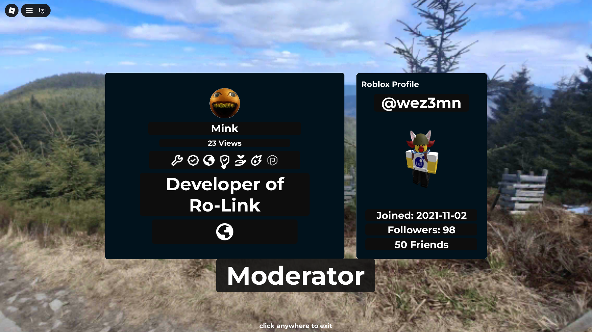
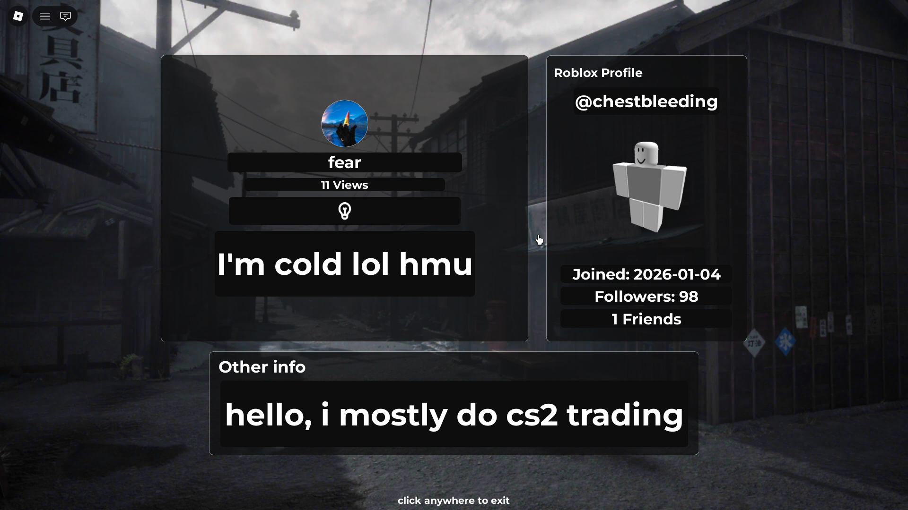
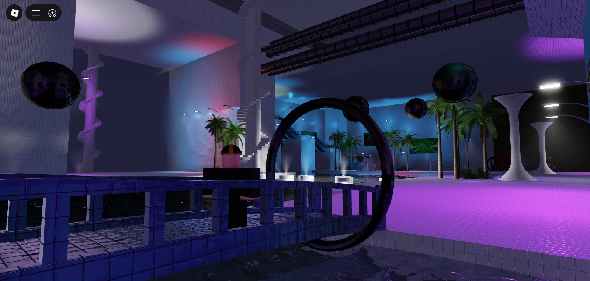
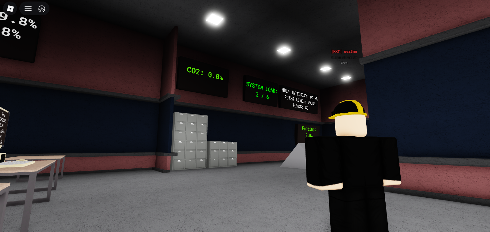
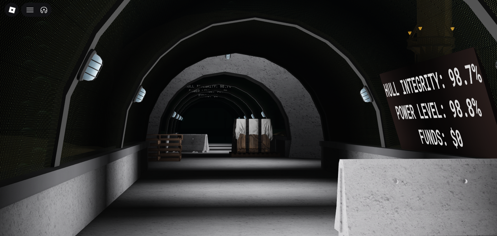

# Bio
## Introductions
Ok so I kinda like have to make a portfolio because I realised that my skill can be used for more than stupid games.. namely I wanna get into STEC or Tellus ar. so I had to make this portfolio

If you wanna see my scripting skills for UI (which might be one of my strong suits but I know how to code server-side well too) go to codesnippet.lua

A it of a secret talent: I am not even kidding, being so deadass, like as serious as a person can be, I also draw furries (i am not a furry myself though I draw other stuff too), check the "Art" folder I created in this repo

## Personal 
I also wanna include more personal stuff because that's like uhh important sometimes

I am a czech sea scout leader, pentuple polygot, coder, designer, writer, academic beast, music lover and cat person, I also draw (as mentioned above) and I also like math. Considering furryism and alcoholism. (both a joke) I love larp and also my github and discord pfp is me in the m53 czechoslovak helmet (original used piece)

# Actual Production
## Ro-Link
Ro-link is a feature-rich profile/portfolio/introduction page making game. The dashboard offers custom bios, pronouns, background images, profile pictures and more. More info about Ro-Link is inside of the codesnippet.lua file in "Scripts"

<table border="0" cellpadding="10" cellspacing="0" width="100%">
  <tr>
    <td width="45%" align="center" valign="middle">
      
    </td>
    <td width="55%" valign="middle" style="font-size: 16px; line-height: 1.6;">
      

        Your expression on Ro-Link is fully in your hands with my dashboard and customization features, this is my profile..
      

    </td>
  </tr>
</table>

<table border="0" cellpadding="10" cellspacing="0" width="100%">
  <tr>
    <td width="55%" valign="middle" style="font-size: 16px; line-height: 1.6;">
      

        You can very easily create cool-looking, minimalist and cold profiles, this is the profile of a random user. The only limitation is Roblox itself, it compresses many images.
      

      

        <strong>Check your profile editing dashboard for your link.</strong>
      

    </td>
    <td width="45%" align="center" valign="middle">
      
    </td>
  </tr>
</table>

## Burger Game
stim game, not finished, still shows the skill on server-side (even if it can be shitty because it isn't finished) 
## Fling
I no longer have control over the account this game is hosted on, but it is my game, all movement and camera systems are made by me, shows my ability to work with the way players interact with the game.

## Lesser projects
projects that never saw the day of light but I think are worth mentioning

### Sobertiy Pools
an unsettling game with Y2K, Liquid glass and Frutiger Aero elements. It is the game I used the camera damp. script (codesnippet2.lua) in.

<table border="0" cellpadding="10" cellspacing="0" width="100%">
  <tr>
    <td width="55%" valign="middle" style="font-size: 16px; line-height: 1.6;">
      

        A real screenshot from the game 
      

      

        <strong>The map is not finished and probably won't be ever.</strong>
      

    </td>
    <td width="45%" align="center" valign="middle">
      
    </td>
  </tr>
</table>

### Jizian Empire Underwater Research Station (JEURS)
unfinished larp game I wanted to make for my group (Jizian Empire) but never ended up finshing. It is similar to naramo and some other research games.
It offers an entire team system with leveling, ranks with leveling, administration quests, machinery wing where the facility has to be maintained. 
The entire core (the hull) can be destroyed, repaired and managed. The higher the payload on the hull, the more money, electricity but the hull breaks faster and more features. I spent a lot of hours and time working on this game but I decided that it wasn't good enough to release, it is still important to talk about I feel like because of how complex the game's code got sometimes. 

<table border="0" cellpadding="10" cellspacing="0" width="100%">
  <tr>
    <td width="45%" align="center" valign="middle">
      
    </td>
    <td width="55%" valign="middle" style="font-size: 16px; line-height: 1.6;">
      

        The JEURS administration wing and facility (hull) control room. All operations are managed from here.
      

    </td>
  </tr>
</table>

<table border="0" cellpadding="10" cellspacing="0" width="100%">
  <tr>
    <td width="55%" valign="middle" style="font-size: 16px; line-height: 1.6;">
      

        The JEURS hallways. JEURS has a wide map set at the bottom of the sea split into 3 main wings, scientific, administration and engineering
      

      

        <strong>JEURS is not playable and will not be, these screenshots should be enough.</strong>
      

    </td>
    <td width="45%" align="center" valign="middle">
      
    </td>
  </tr>
</table>
